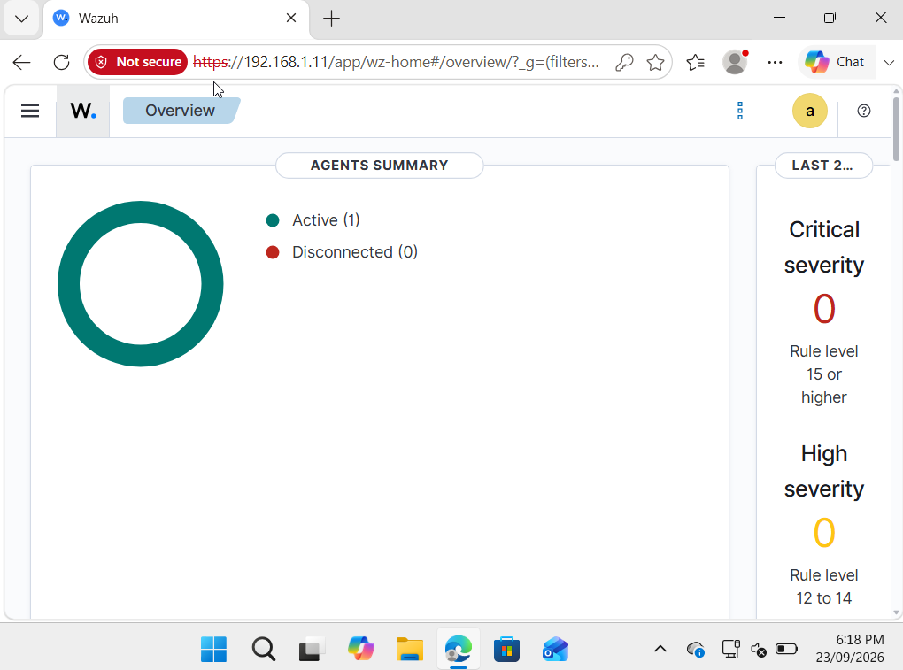
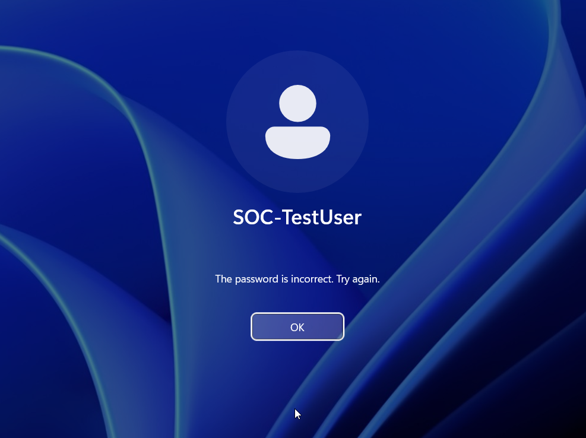
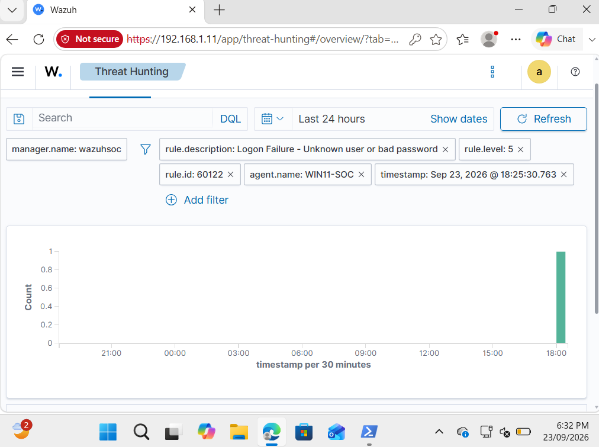
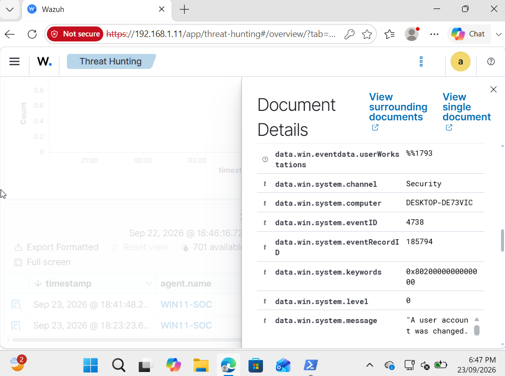
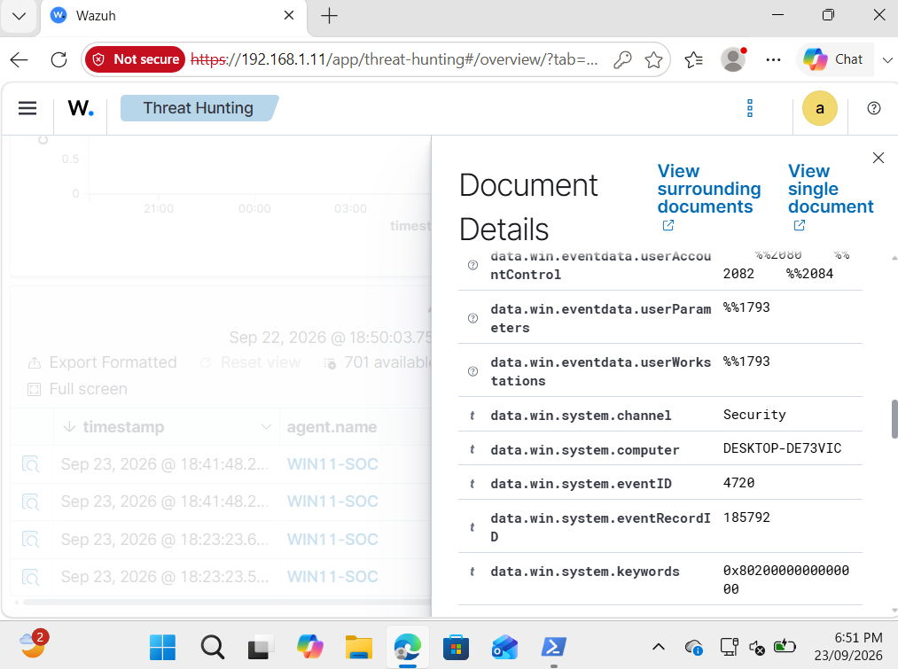
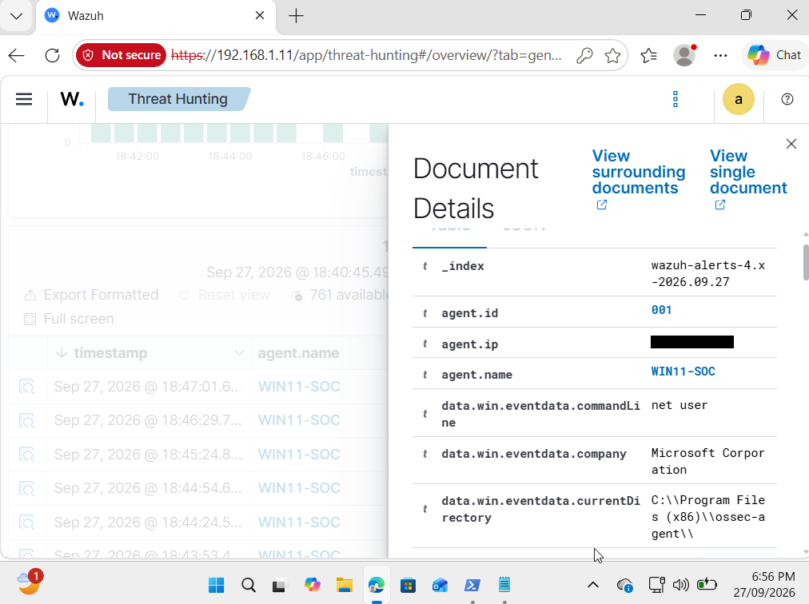
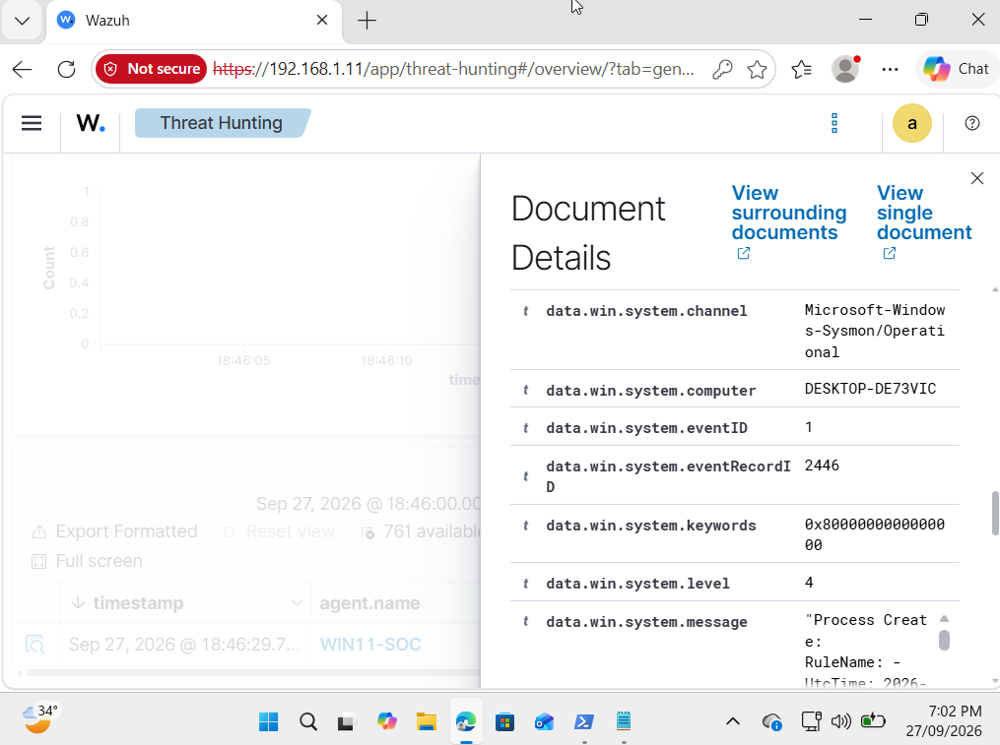
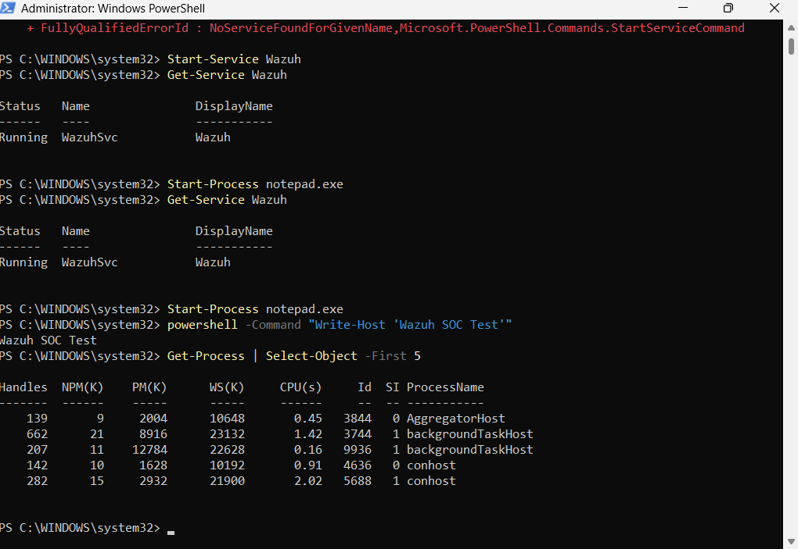
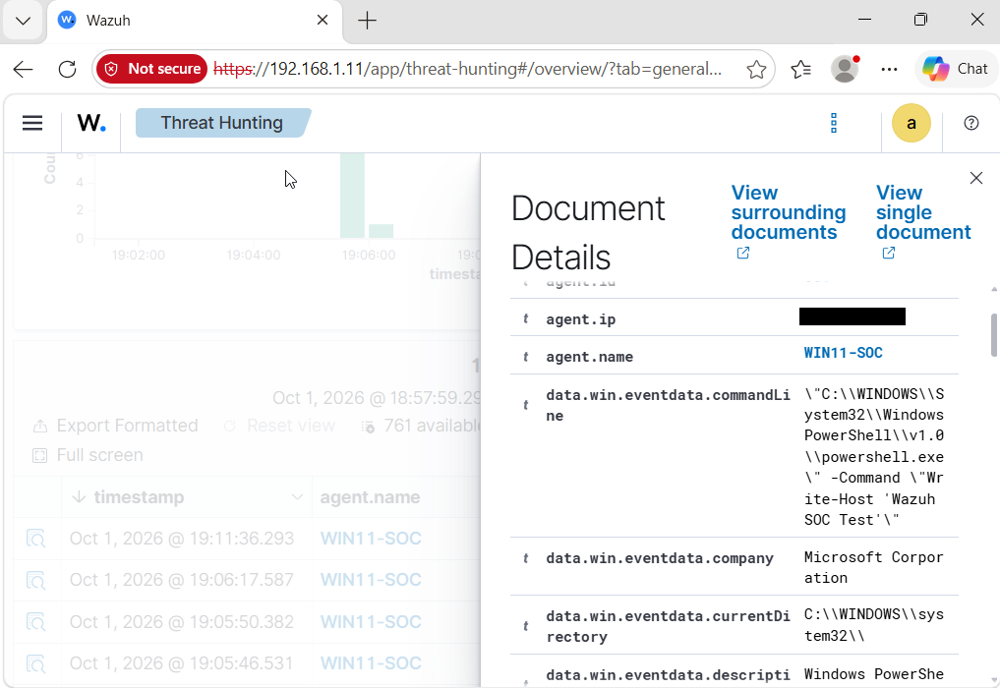
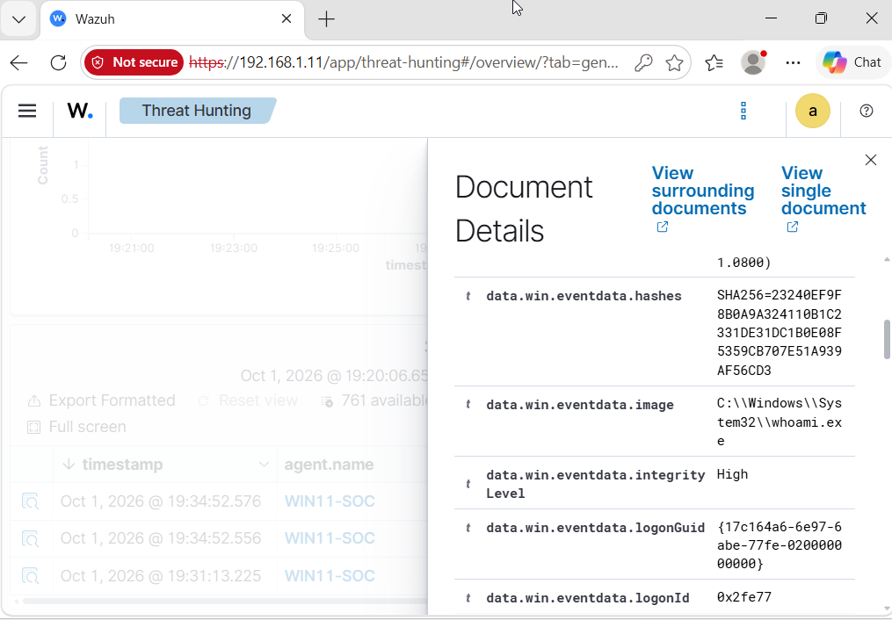

# Wazuh SOC Threat Detection

> A Windows security monitoring and threat-detection project using Wazuh and Sysmon to collect, investigate, and analyse endpoint security events.

## Overview

This project demonstrates the implementation of a Security Operations Center (SOC) monitoring environment using **Wazuh**, **Windows 11**, and **Sysmon**.

A Windows endpoint was connected to Wazuh for centralized security monitoring. Sysmon was integrated to provide detailed process telemetry, while Windows Security logs were used to monitor authentication and account-management activity.

Controlled security events were generated and subsequently investigated through Wazuh's threat-hunting capabilities.

The project focuses on practical SOC analyst activities including:

- Security event monitoring
- Windows log analysis
- Authentication failure investigation
- User account activity monitoring
- Sysmon telemetry analysis
- PowerShell monitoring
- Process creation analysis
- Threat hunting and event correlation

---

## Architecture

```text
┌──────────────────────────┐
│      Windows 11 VM       │
│                          │
│  Windows Security Logs   │
│  Sysmon Telemetry        │
└────────────┬─────────────┘
             │
             │ Wazuh Agent
             ▼
┌──────────────────────────┐
│       Wazuh Server       │
│                          │
│  Manager                 │
│  Indexer                 │
│  Dashboard               │
└────────────┬─────────────┘
             │
             ▼
┌──────────────────────────┐
│    Security Analysis     │
│                          │
│  Threat Hunting          │
│  Event Investigation     │
│  Detection Analysis      │
└──────────────────────────┘
```

---

## Technologies

| Technology | Purpose |
|---|---|
| **Wazuh** | SIEM/XDR monitoring, event collection and security analysis |
| **Windows 11** | Monitored endpoint |
| **Wazuh Agent** | Endpoint telemetry forwarding |
| **Sysmon** | Detailed Windows process telemetry |
| **Windows Event Logs** | Authentication and account-management telemetry |
| **PowerShell** | Controlled security testing and process generation |
| **VirtualBox** | Virtualized project environment |

---

## Detection Summary

| Detection | Data Source | Event ID | Result |
|---|---|---:|---|
| Failed Windows Authentication | Windows Security | 4625 | Detected |
| User Account Creation | Windows Security | 4720 | Detected |
| User Account Modification | Windows Security | 4738 | Detected |
| Process Creation | Sysmon | 1 | Detected |
| PowerShell Execution | Sysmon | 1 | Detected |
| Command-Line Discovery (`whoami`) | Sysmon | 1 | Detected |

---

# 1. Endpoint Monitoring

The Windows 11 endpoint was successfully connected to the Wazuh server using the Wazuh agent.

The dashboard confirmed that the endpoint was active and communicating with the monitoring infrastructure.



**Result:** Endpoint telemetry was successfully received by Wazuh.

---

# 2. Failed Authentication Detection

### Objective

Validate Wazuh's ability to identify and investigate unsuccessful Windows authentication attempts.

### Test Activity

A controlled failed login was generated against the Windows test account.



### Detection

Wazuh successfully identified the authentication failure and presented the event within the security monitoring interface.



Detailed analysis identified:

| Field | Value |
|---|---|
| Event ID | `4625` |
| Category | Authentication Failure |
| Source | Windows Security |
| Detection Status | Successful |


### Analysis

Windows Event ID **4625** is generated when an account fails to authenticate.

Monitoring these events can assist analysts in identifying suspicious authentication behaviour such as repeated password failures, password guessing, and potential brute-force activity.

A single failed authentication does not inherently indicate malicious activity, so surrounding context and repeated events should be considered during investigation.

---

# 3. Windows Account Activity Monitoring

### Objective

Identify security-relevant Windows account-management activity through centralized event monitoring.

## Account Modification

Wazuh captured Windows Event ID **4738**, indicating that a user account had been modified.



## Account Creation

Windows Event ID **4720** was also captured, providing evidence of user-account creation activity.



### Analysis

Account-management events are valuable during security investigations because unauthorized account creation or modification can be associated with persistence or privilege-related activity.

Legitimate administrative actions can generate the same events. Therefore, analysts should correlate account-management events with the responsible user, timestamp, endpoint and surrounding activity before determining whether the behaviour is suspicious.

---

# 4. Sysmon Process Monitoring

### Objective

Verify that Sysmon process-creation telemetry was successfully collected and searchable through Wazuh.

Sysmon was configured on the Windows endpoint and its telemetry was forwarded through the Wazuh agent.

Process activity involving the Windows `net` utility was successfully identified.



Further investigation confirmed a Sysmon **Event ID 1 – Process Create** event.



### Analysis

Sysmon Event ID **1** provides detailed information about newly created processes.

Depending on the Sysmon configuration, this telemetry can include information such as:

- Process image
- Command line
- Parent process
- User context
- Process ID
- Execution timestamp

This provides greater visibility into endpoint activity and allows SOC analysts to investigate how processes were executed rather than relying solely on high-level security alerts.

---

# 5. PowerShell Execution Monitoring

### Objective

Determine whether PowerShell execution and associated command-line activity could be identified using Sysmon and Wazuh.

### Controlled Test

The following benign PowerShell command was executed:

```powershell
powershell -Command "Write-Host 'Wazuh SOC Test'"
```



### Investigation

The resulting process-creation event was located within Wazuh.

Event analysis showed:

| Field | Observed Value |
|---|---|
| Provider | `Microsoft-Windows-Sysmon` |
| Event ID | `1` |
| Process | `powershell.exe` |
| Process ID | `3184` |
| Command Line | `Write-Host "Wazuh SOC Test"` |



### Analysis

PowerShell is widely used for legitimate Windows administration and automation, but it can also appear during malicious activity.

Capturing PowerShell process creation and command-line telemetry gives analysts additional context for determining **what was executed**, **which process initiated it**, and **under which user context it occurred**.

PowerShell execution itself should therefore not automatically be treated as malicious; the command, parent process, user and surrounding events should be considered.

---

# 6. Command-Line Discovery Monitoring

### Objective

Demonstrate the detection of a Windows command-line utility commonly observed during system and user discovery.

A controlled command was executed:

```cmd
cmd.exe /c whoami
```

The command returns the security context of the currently logged-in user.

Sysmon subsequently captured execution of:

```text
C:\Windows\System32\whoami.exe
```



### Analysis

`whoami.exe` is a legitimate Windows utility and its presence alone does not indicate compromise.

However, user-context discovery can be relevant during investigations because similar commands may be executed during administrative troubleshooting as well as post-compromise reconnaissance.

By collecting the associated process telemetry, Wazuh provides analysts with evidence that can be correlated with other endpoint activity.

---

# Investigation Workflow

The project followed a repeatable SOC investigation process:

```text
Generate Controlled Activity
          │
          ▼
Windows / Sysmon Generates Event
          │
          ▼
Wazuh Agent Collects Telemetry
          │
          ▼
Wazuh Indexes the Event
          │
          ▼
Threat Hunting Query
          │
          ▼
Review Event Details
          │
          ▼
Analyse Security Context
```

This approach demonstrates the complete path from endpoint activity to analyst investigation.

---

# Key Findings

The project successfully demonstrated centralized collection and analysis of Windows endpoint telemetry.

Testing confirmed that:

- The Windows endpoint successfully communicated with the Wazuh server.
- Windows authentication failures were visible within Wazuh.
- User account creation and modification events could be investigated.
- Sysmon telemetry was successfully integrated with Wazuh.
- Process creation events were searchable through the threat-hunting interface.
- PowerShell execution and command-line information could be observed.
- Windows command-line utilities such as `whoami.exe` could be identified through process telemetry.

The testing also demonstrated an important SOC principle: **an individual event does not automatically indicate malicious activity**. Events must be interpreted using their surrounding context.

---

# Skills Demonstrated

### SIEM & Monitoring
- Wazuh deployment and operation
- Endpoint agent monitoring
- Security event collection
- Threat hunting

### Windows Security
- Windows Security Event analysis
- Authentication monitoring
- Account-management monitoring
- Windows process analysis

### Endpoint Telemetry
- Sysmon configuration and integration
- Process creation monitoring
- Command-line analysis
- PowerShell monitoring

### SOC Analysis
- Controlled detection testing
- Event filtering
- Security event investigation
- Evidence collection
- Detection validation
- Technical documentation

---

# Project Evidence

The main README contains selected evidence from each investigation to maintain readability.

Additional search queries, event details and supporting screenshots are available in the:

```text
/screenshots
```

directory.

---

# Repository Structure

```text
Wazuh-SOC-Threat-Detection/
│
├── README.md
│
└── screenshots/
    ├── 01-wazuh-dashboard-agent.png
    ├── 02-failed-login-test.png
    ├── 03-authentication-failures.png
    ├── 04-logon-failure-alert.png
    ├── 05-event-4625-details.png
    ├── 06-account-change-search.png
    ├── 07-event-4738-details.png
    ├── 08-account-created-enabled.png
    ├── 09-event-4720-details.png
    ├── 10-sysmon-events.png
    ├── 11-net-user-event.png
    ├── 12-sysmon-filter-result.png
    ├── 13-net-user-query.png
    ├── 14-sysmon-event-id-1.png
    ├── 15-powershell-test-command.png
    ├── 16-powershell-event-id-1.png
    ├── 17-powershell-commandline.png
    ├── 18-cmd-whoami-test.png
    └── 19-whoami-process-event.png
```

---

## Security & Ethics

All testing documented in this repository was performed within an isolated, controlled environment using systems and accounts authorized for testing.

The activity was conducted exclusively for cybersecurity education, defensive monitoring and SOC skill development.

---

## Author

**Muhammad Mubashir Noman**

Cybersecurity Student | SOC & Security Operations
