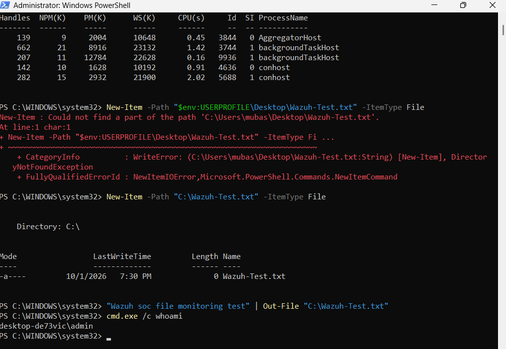

# 🛡️ Wazuh SOC Threat Detection

> **Windows endpoint security monitoring, threat detection, and event investigation using Wazuh, Sysmon, Windows Security logs, and the MITRE ATT&CK framework.**

---

## 📌 Project Overview

This project demonstrates the implementation of a **Security Operations Center (SOC) monitoring environment** using **Wazuh, Windows 11, and Sysmon**.

A Windows 11 endpoint was integrated with Wazuh to provide centralized collection and analysis of endpoint security telemetry. Windows Security logs were used to monitor authentication and account-management activity, while Sysmon provided additional visibility into process creation and command-line execution.

Controlled security events were generated and investigated through the **Wazuh Threat Hunting** interface, demonstrating a practical SOC workflow from event generation through detection, investigation, and analysis.

Where applicable, observed activity was mapped to relevant **MITRE ATT&CK Enterprise techniques** to relate endpoint telemetry to documented adversary behaviours.

### Project Objectives

- Implement centralized Windows security monitoring with Wazuh
- Connect and monitor a Windows 11 endpoint
- Integrate Sysmon telemetry with Wazuh
- Monitor Windows authentication activity
- Investigate Windows account-management events
- Analyse process-creation telemetry
- Monitor PowerShell execution
- Identify command-line discovery activity
- Perform threat hunting using endpoint telemetry
- Map relevant behaviours to MITRE ATT&CK
- Document security findings using a structured SOC investigation approach

---

## 🏗️ Architecture

```text
┌─────────────────────────────┐
│       Windows 11 VM         │
│                             │
│  • Windows Security Logs    │
│  • Sysmon Telemetry         │
└──────────────┬──────────────┘
               │
               │ Wazuh Agent
               ▼
┌─────────────────────────────┐
│        Wazuh Server         │
│                             │
│  • Manager                  │
│  • Indexer                  │
│  • Dashboard                │
└──────────────┬──────────────┘
               │
               ▼
┌─────────────────────────────┐
│      SOC Investigation      │
│                             │
│  • Threat Hunting           │
│  • Event Analysis           │
│  • Detection Validation     │
│  • ATT&CK Mapping           │
└─────────────────────────────┘
```

---

## 🧰 Technologies Used

| Technology | Purpose |
|---|---|
| **Wazuh** | SIEM/XDR monitoring, event collection, threat hunting, and security analysis |
| **Windows 11** | Monitored endpoint |
| **Wazuh Agent** | Endpoint telemetry collection and forwarding |
| **Sysmon** | Detailed Windows process and command-line telemetry |
| **Windows Event Logs** | Authentication and account-management telemetry |
| **PowerShell** | Controlled process-execution testing |
| **VirtualBox** | Virtualized security environment |
| **MITRE ATT&CK** | Behavioural mapping and threat-analysis framework |

---

## 🖥️ Endpoint Monitoring

The Windows 11 endpoint was successfully registered with the Wazuh server through the Wazuh agent.

The Wazuh dashboard confirmed that the endpoint was active and communicating with the monitoring infrastructure, establishing the telemetry pipeline required for subsequent investigations.


*Figure 1 – Wazuh dashboard confirming the active Windows endpoint.*

**Result:** Endpoint telemetry was successfully received by Wazuh.

---

## 🎯 Detection Summary

| Detection | Data Source | Event ID | MITRE ATT&CK Context | Result |
|---|---|---:|---|---|
| Failed Windows Authentication | Windows Security | `4625` | Authentication monitoring | ✅ Detected |
| Local Account Creation | Windows Security | `4720` | **T1136.001 – Create Account: Local Account** | ✅ Detected |
| User Account Modification | Windows Security | `4738` | **T1098 – Account Manipulation** *(context-dependent)* | ✅ Detected |
| Process Creation | Sysmon | `1` | Supporting process telemetry | ✅ Detected |
| PowerShell Execution | Sysmon | `1` | **T1059.001 – PowerShell** | ✅ Detected |
| User Discovery (`whoami`) | Sysmon | `1` | **T1033 – System Owner/User Discovery** | ✅ Detected |

> **Note:** MITRE ATT&CK mappings provide behavioural context. The controlled activities performed in this project were benign, and an ATT&CK mapping does not independently establish malicious activity.

---

# 1. Failed Authentication Detection

### Objective

Validate Wazuh's ability to identify and investigate unsuccessful Windows authentication attempts.

### Controlled Test

A controlled incorrect-password attempt was generated against a Windows test account.


*Figure 2 – Controlled failed Windows authentication attempt.*

### Detection

Wazuh successfully collected and displayed the resulting authentication failure.


*Figure 3 – Authentication failure identified through Wazuh Threat Hunting.*

Detailed event analysis identified:

| Field | Value |
|---|---|
| **Windows Event ID** | `4625` |
| **Category** | Authentication Failure |
| **Source** | Windows Security |
| **Wazuh Rule ID** | `60122` |
| **Rule Level** | `5` |
| **Result** | Successfully detected |


*Figure 4 – Windows Security Event ID 4625 details collected by Wazuh.*

### Analysis

Windows Event ID **4625** records unsuccessful Windows authentication attempts.

Monitoring this event can assist analysts in identifying repeated password failures, password guessing, and other unusual authentication patterns.

A single failed authentication does not automatically indicate malicious activity. Analysts should consider factors such as the frequency of attempts, target account, source, timing, authentication method, and surrounding endpoint activity.

---

# 2. Windows Account Activity Monitoring

### Objective

Identify and investigate security-relevant Windows account-management activity through centralized event monitoring.

## Account Modification

Wazuh captured Windows Security Event ID **4738**, indicating that a user account had been modified.


*Figure 5 – Windows Event ID 4738 showing account modification activity.*

Account-modification telemetry may provide investigative context for **MITRE ATT&CK T1098 – Account Manipulation** when account changes are performed to maintain or increase access.

This mapping is context-dependent. Legitimate administrative changes can generate the same Windows event, so Event ID 4738 alone should not be interpreted as evidence of malicious account manipulation.

## Account Creation

Wazuh also captured Windows Security Event ID **4720**, indicating that a Windows user account had been created.


*Figure 6 – Windows Event ID 4720 showing account creation activity.*

### MITRE ATT&CK Mapping

**T1136.001 – Create Account: Local Account**

Local-account creation may be relevant during security investigations because accounts can be created to establish additional access or persistence.

Windows Event ID `4720` provides useful telemetry for identifying and investigating account-creation activity.

### Analysis

Account-management events are valuable during security investigations because unexpected account creation or modification can indicate unauthorized administrative activity.

Analysts should correlate these events with:

- User responsible for the action
- Account affected
- Endpoint
- Timestamp
- Privilege level
- Related authentication activity
- Related process execution
- Surrounding security events

---

# 3. Sysmon Process Monitoring

### Objective

Validate that detailed Sysmon process-creation telemetry was successfully collected and searchable through Wazuh.

Sysmon was configured on the Windows endpoint, with its telemetry forwarded through the Wazuh agent.

### Process Activity

Process activity involving the Windows `net` utility was successfully identified.


*Figure 7 – Windows `net user` process activity identified through Wazuh.*

Further investigation confirmed:

```text
Provider: Microsoft-Windows-Sysmon
Event ID: 1
Event Type: Process Create
```


*Figure 8 – Sysmon Event ID 1 process-creation telemetry collected by Wazuh.*

### Analysis

Sysmon Event ID **1** records process creation and can provide detailed endpoint telemetry including:

- Process image
- Command line
- Parent process
- User context
- Process ID
- Execution timestamp

This visibility allows analysts to investigate how a process was executed rather than relying solely on high-level security alerts.

Sysmon Event ID 1 itself is not a MITRE ATT&CK technique. Instead, the process, command line, parent process, user, and surrounding behaviour can be analysed to determine whether an ATT&CK mapping is appropriate.

---

# 4. PowerShell Execution Monitoring

### Objective

Determine whether PowerShell process execution and associated command-line activity could be identified through Sysmon and Wazuh.

### Controlled Test

The following benign PowerShell command was executed:

```powershell
powershell -Command "Write-Host 'Wazuh SOC Test'"
```


*Figure 9 – Controlled PowerShell execution used to generate process telemetry.*

### Investigation

The resulting process-creation event was located within Wazuh.

Event analysis identified:

| Field | Observed Value |
|---|---|
| **Provider** | `Microsoft-Windows-Sysmon` |
| **Event ID** | `1` |
| **Process** | `powershell.exe` |
| **Process ID** | `3184` |
| **Command Line** | `Write-Host "Wazuh SOC Test"` |


*Figure 10 – PowerShell process and command-line telemetry captured by Sysmon and Wazuh.*

### MITRE ATT&CK Mapping

**T1059.001 – Command and Scripting Interpreter: PowerShell**

The observed PowerShell execution provides telemetry relevant to **T1059.001**.

PowerShell is a legitimate Windows administration and automation technology, but it can also be used during adversary activity for command and script execution.

### Analysis

The test demonstrated that Sysmon and Wazuh could provide visibility into PowerShell process execution and associated command-line information.

PowerShell execution itself is **not evidence of malicious activity**.

During an investigation, analysts should consider additional context including the command contents, parent process, user account, child processes, network activity, and surrounding endpoint events.

---

# 5. Command-Line User Discovery

### Objective

Demonstrate visibility into Windows command-line activity associated with identifying the current user context.

### Controlled Test

The following command was executed:

```cmd
cmd.exe /c whoami
```

The command returned the security context of the currently logged-in user.



*Figure 11 – Controlled execution of the Windows `whoami` utility.*

### Detection

Sysmon subsequently captured execution of:

```text
C:\Windows\System32\whoami.exe
```


*Figure 12 – `whoami.exe` process creation captured by Sysmon and Wazuh.*

### MITRE ATT&CK Mapping

**T1033 – System Owner/User Discovery**

The observed activity provides telemetry relevant to **System Owner/User Discovery**.

Commands such as `whoami` can be used to identify the account under which commands are executing.

### Analysis

`whoami.exe` is a legitimate Windows utility commonly used for administration and troubleshooting.

However, user-context discovery can also occur during post-compromise reconnaissance.

The process should therefore be correlated with its parent process, user, previous commands, subsequent activity, authentication events, and other endpoint telemetry.

---

# 🗺️ MITRE ATT&CK Mapping

The security events investigated during this project were mapped to relevant techniques within the **MITRE ATT&CK Enterprise framework**.

ATT&CK mapping provides additional behavioural context by relating observed endpoint activity to techniques that may also appear during real-world adversary operations.

## ATT&CK Mapping Summary

| Observed Activity | Telemetry | MITRE ATT&CK Technique | Technique ID |
|---|---|---|---|
| Local account creation | Windows Event ID `4720` | Create Account: Local Account | **T1136.001** |
| Account modification | Windows Event ID `4738` | Account Manipulation | **T1098** *(context-dependent)* |
| PowerShell execution | Sysmon Event ID `1` | Command and Scripting Interpreter: PowerShell | **T1059.001** |
| `whoami` execution | Sysmon Event ID `1` | System Owner/User Discovery | **T1033** |

## ATT&CK Coverage

```text
MITRE ATT&CK Enterprise
│
├── Execution
│   └── T1059 – Command and Scripting Interpreter
│       └── T1059.001 – PowerShell
│
├── Persistence
│   └── T1136 – Create Account
│       └── T1136.001 – Local Account
│
└── Discovery
    └── T1033 – System Owner/User Discovery
```

Account-modification telemetry may additionally provide investigative context for:

```text
T1098 – Account Manipulation
```

depending on the specific modification and surrounding security context.

> **ATT&CK mappings describe security-relevant behaviours and should not be interpreted as proof that malicious activity occurred. Legitimate administrative activity can produce many of the same events.**

---

# 🔄 Investigation Workflow

The project followed a repeatable SOC investigation process:

```text
Generate Controlled Activity
          │
          ▼
Windows / Sysmon Event
          │
          ▼
Wazuh Agent Collects Telemetry
          │
          ▼
Wazuh Indexes Event
          │
          ▼
Threat Hunting
          │
          ▼
Review Event Details
          │
          ▼
Analyse Security Context
          │
          ▼
MITRE ATT&CK Mapping
```

This workflow demonstrates the progression from endpoint activity to centralized collection, investigation, contextual analysis, and behavioural mapping.

---

# 📊 Key Findings

The project successfully demonstrated centralized collection and analysis of Windows endpoint telemetry.

Testing confirmed that:

- The Windows endpoint successfully communicated with Wazuh.
- Windows authentication failures could be investigated centrally.
- Failed authentication activity was identified using Event ID `4625`.
- User account creation was identified using Event ID `4720`.
- User account modification was identified using Event ID `4738`.
- Sysmon telemetry was successfully integrated with Wazuh.
- Sysmon Event ID `1` provided process-creation visibility.
- PowerShell execution and associated command-line information could be observed.
- Windows utilities such as `whoami.exe` could be identified through process telemetry.
- Selected behaviours could be mapped to relevant MITRE ATT&CK techniques.

A key principle demonstrated throughout the project is that **an individual event does not automatically indicate malicious activity**. Security telemetry must be interpreted using its surrounding context.

---

# 🧠 Skills Demonstrated

### SIEM & Security Monitoring

- Wazuh deployment and operation
- Endpoint agent monitoring
- Centralized security-event collection
- Threat hunting
- Event filtering
- Detection validation

### Windows Security

- Windows Security Event analysis
- Authentication monitoring
- Account-management monitoring
- Windows process analysis
- Command-line investigation

### Endpoint Telemetry

- Sysmon integration
- Process creation monitoring
- PowerShell monitoring
- Command-line telemetry analysis
- Parent/child process investigation

### SOC Analysis

- Controlled detection testing
- Event triage
- Security-event investigation
- Evidence collection
- Detection analysis
- Context-based event interpretation
- Technical documentation

### Threat Analysis

- MITRE ATT&CK mapping
- ATT&CK technique identification
- Behavioural analysis
- Mapping endpoint telemetry to adversary techniques

---

# 📸 Project Evidence

A total of **19 screenshots** were collected during the project.

To maintain a clear and professional README, the strongest evidence from each investigation is displayed within the relevant detection section. Additional screenshots are retained in the repository as supporting investigation evidence.

## Evidence Displayed in the README

| Screenshot | README Location | Evidence |
|---|---|---|
| **01** | Endpoint Monitoring | Wazuh dashboard showing active endpoint |
| **02** | Failed Authentication | Controlled failed-login attempt |
| **04** | Failed Authentication | Wazuh authentication detection |
| **05** | Failed Authentication | Event ID `4625` details |
| **07** | Account Activity | Event ID `4738` account modification |
| **09** | Account Activity | Event ID `4720` account creation |
| **11** | Sysmon Monitoring | `net user` process activity |
| **14** | Sysmon Monitoring | Sysmon Event ID `1` |
| **15** | PowerShell Monitoring | Controlled PowerShell execution |
| **17** | PowerShell Monitoring | Captured PowerShell command line |
| **18** | User Discovery | Controlled `whoami` execution |
| **19** | User Discovery | `whoami.exe` process detection |

## Supporting Evidence

The following screenshots remain available in the `screenshots/` directory as additional investigation evidence:

| Screenshot | Evidence |
|---|---|
| **03** | Additional authentication-failure results |
| **06** | Account-change search |
| **08** | Account creation/enabling search |
| **10** | General Sysmon event ingestion |
| **12** | Additional filtered Sysmon result |
| **13** | `net user` threat-hunting query |
| **16** | Additional PowerShell Event ID 1 evidence |

This preserves the complete investigation evidence while keeping the main README focused and readable.

---

# 📁 Repository Structure

```text
Wazuh-SOC-Threat-Detection/
│
├── README.md
│
└── screenshots/
    ├── 01-wazuh-dashboard-agent.png
    ├── 02-failed-login-test.png
    ├── 03-authentication-failures.png
    ├── 04-logon-failure-alert.png
    ├── 05-event-4625-details.png
    ├── 06-account-change-search.png
    ├── 07-event-4738-details.png
    ├── 08-account-created-enabled.png
    ├── 09-event-4720-details.png
    ├── 10-sysmon-events.png
    ├── 11-net-user-event.png
    ├── 12-sysmon-filter-result.png
    ├── 13-net-user-query.png
    ├── 14-sysmon-event-id-1.png
    ├── 15-powershell-test-command.png
    ├── 16-powershell-event-id-1.png
    ├── 17-powershell-commandline.png
    ├── 18-cmd-whoami-test.png
    └── 19-whoami-process-event.png
```

---

# ⚠️ Security & Ethics

All testing documented in this repository was performed within an **isolated and controlled environment** using systems and accounts authorized for testing.

The activities were conducted exclusively for:

- Cybersecurity education
- Defensive security monitoring
- Detection validation
- Threat-hunting practice
- SOC skill development

No testing was performed against systems without authorization.

---

## 👤 Author

**Muhammad Mubashir Noman**

Cybersecurity Student | SOC & Security Operations
